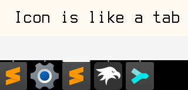

# BottomDensy theme for Windows 11 Taskbar Styler

**Author**: [es](https://github.com/eugenesvk)


Or an even more dense variant by removing the inactive app indicator (useful if you only have a couple of pinned icons, so it's easier to indicate the few non-running apps):


## Notes

A dense theme eliminating some of the excessive/useless taskbar UI elements for better visibility at a smaller screen area "cost":
  - **Icons**
    - Align to the bottom of the screen: padding below icons serves no useful purpose
    - (Via another mod) make icons bigger @`32` to match their "natural"/not downscaled size
    - Make **Notification icons** bigger @`20` (set width to `@21` via another mod to have a small gap)
  - Running app **indicators**: move above the icon to make the icons "merge" with/"extend" into the fullscreen borderless apps like a bottom tab (but only if the background color matches) 


   
 - Active: Full icon width for a better "merging" effect. Tip: Change active running indicator color to match your borderless app background, to make an icon "extend" into the app
      - Target: `Taskbar.TaskListLabeledButtonPanel@RunningIndicatorStates > Rectangle#RunningIndicator`
      - Style: `Fill@ActiveRunningIndicator=#fef9f0`
    - Inactive: Make them tiny, since usually you only have a few icons "pinned", so not that much need to separate running apps from pinned apps to begin with. Most of the icons will have a running indicator, so if it's big as in default style, that's just extra noise.
  - **Start Button**: removed since the ↙ corner already has ∞ dimensions across both horizontal and vertical axes, so it's more convenient to simply move your mouse until the very end to the corner (will never miss) instead of trying to precisely stop at the Start button. Downside: on hover at the ↙ corner you see a popup for the left-most icon
  - **Show Desktop indicator**: minimized to 1px for the same reason: ↘ corner has ∞ dimensions
  - **Taskbar**: Make transparent and (via another mod) reduce height to leave no useless space above icons (except for the space used for indicators)

`BottomDensyNoInd` is based on `BottomDensy`, but 2px smaller!
    - Top padding used for indicators removed
    - Active running indicator remains, but eats into the icon size instead
    - Inactive running indicator removed since almost all icons in the taskbar are running
    - Non running apps are indicated via a smaller icon instead

### Suggested Windows settings

- Set taskbar alignment to left
- Use bigger icons and smaller taskbar settings for `Taskbar Height and Icon Size` (see config below)
- Change active running indicator color to match the background of your most commonly used apps to make the icon "merge" with the window.

## Manual installation

* Open Windhawk
* Open the `Windows 11 Taskbar Styler` mod by clicking on the `Details` button
* Go to the `Advanced` tab
* Copy the content below to the text box under `Mod settings` and click `Save`
* Do the same for `Taskbar height and icon size`

<details>
<summary>Content to import (click to expand)</summary>

## Theme

`BottomDensy`
```json
{
"controlStyles[0].target"   :"Taskbar.TaskbarFrame > Grid#RootGrid > Taskbar.TaskbarBackground > Grid > Rectangle#BackgroundFill",
"controlStyles[0].styles[0]":"Fill=Transparent",
"controlStyles[1].target"   :"Rectangle#BackgroundStroke",
"controlStyles[1].styles[0]":"Fill=Transparent",
"controlStyles[2].target"   :"Taskbar.TaskListLabeledButtonPanel@RunningIndicatorStates > Rectangle#RunningIndicator",
"controlStyles[2].styles[0]":"Fill=#8f8f8f",
"controlStyles[2].styles[1]":"Fill@ActiveRunningIndicator=#fef9f0",
"controlStyles[2].styles[2]":"Width=2",
"controlStyles[2].styles[3]":"Height=2",
"controlStyles[2].styles[4]":"Margin=0,-2,0,0",
"controlStyles[2].styles[5]":"Width@ActiveRunningIndicator=32",
"controlStyles[3].target"   :"Taskbar.TaskListLabeledButtonPanel@RunningIndicatorStates > muxc:ProgressBar#ProgressIndicator",
"controlStyles[3].styles[0]":"VerticalAlignment=0",
"controlStyles[4].target"   :"Rectangle#RunningIndicator",
"controlStyles[4].styles[0]":"VerticalAlignment=0",
"controlStyles[5].target"   :"Border#ProgressBarRoot",
"controlStyles[5].styles[0]":"VerticalAlignment=0",
"controlStyles[6].target"   :"Rectangle#IndeterminateProgressBarIndicator",
"controlStyles[6].styles[0]":"VerticalAlignment=0",
"controlStyles[7].target"   :"Rectangle#IndeterminateProgressBarIndicator2",
"controlStyles[7].styles[0]":"VerticalAlignment=0",
"controlStyles[8].target"   :"Taskbar.TaskListLabeledButtonPanel",
"controlStyles[8].styles[0]":"Padding=2,0,2,0",
"controlStyles[8].styles[1]":"VerticalAlignment=2",
"controlStyles[9].target"   :"Taskbar.ExperienceToggleButton#LaunchListButton[AutomationProperties.AutomationId=StartButton]",
"controlStyles[9].styles[0]":"Visibility=Collapsed",
"controlStyles[10].target"   :"SystemTray.Stack#ShowDesktopStack",
"controlStyles[10].styles[0]":"Width=1",
"controlStyles[11].target"   :"Windows.UI.Xaml.Shapes.Rectangle#ShowDesktopPipe",
"controlStyles[11].styles[0]":"HorizontalAlignment=0",
"controlStyles[12].target"   :"SystemTray.NotificationAreaIcons#NotificationAreaIcons > ItemsPresenter > StackPanel > ContentPresenter > SystemTray.NotifyIconView#NotifyItemIcon > Grid#ContainerGrid > ContentPresenter#ContentPresenter > Grid#ContentGrid > SystemTray.ImageIconContent > Grid#ContainerGrid > Image",
"controlStyles[12].styles[0]":"Width=20",
"controlStyles[12].styles[1]":"Height=20",
"controlStyles[13].target"   :"WrapGrid > ContentPresenter > SystemTray.NotifyIconView > Grid#ContainerGrid > ContentPresenter#ContentPresenter > Grid#ContentGrid > SystemTray.ImageIconContent > Grid#ContainerGrid > Image",
"controlStyles[13].styles[0]":"Width=20",
"controlStyles[13].styles[1]":"Height=20"
}
```

`BottomDensyNoInd`
```json
{
"controlStyles[0].target"   :"Taskbar.TaskbarFrame > Grid#RootGrid > Taskbar.TaskbarBackground > Grid > Rectangle#BackgroundFil",
"controlStyles[0].styles[0]":"Fill=Transparent",
"controlStyles[1].target"   :"Rectangle#BackgroundStroke",
"controlStyles[1].styles[0]":"Fill=Transparent",
"controlStyles[2].target"   :"Taskbar.TaskListLabeledButtonPanel@RunningIndicatorStates > Rectangle#RunningIndicator",
"controlStyles[2].styles[0]":"Fill=#8f8f8f",
"controlStyles[2].styles[1]":"Fill@ActiveRunningIndicator=#fef9f0",
"controlStyles[2].styles[2]":"Width=0",
"controlStyles[2].styles[3]":"Height=0",
"controlStyles[2].styles[4]":"Margin=0,0,0,0",
"controlStyles[2].styles[5]":"Width@ActiveRunningIndicator=32",
"controlStyles[2].styles[6]":"Height@ActiveRunningIndicator=2",
"controlStyles[2].styles[7]":"Margin@ActiveRunningIndicator=0,-2,0,0",
"controlStyles[3].target"   :"Taskbar.TaskListLabeledButtonPanel@RunningIndicatorStates > muxc:ProgressBar#ProgressIndicator",
"controlStyles[3].styles[0]":"VerticalAlignment=0",
"controlStyles[4].target"   :"Rectangle#RunningIndicator",
"controlStyles[4].styles[0]":"VerticalAlignment=0",
"controlStyles[5].target"   :"Border#ProgressBarRoot",
"controlStyles[5].styles[0]":"VerticalAlignment=0",
"controlStyles[6].target"   :"Rectangle#IndeterminateProgressBarIndicator",
"controlStyles[6].styles[0]":"VerticalAlignment=0",
"controlStyles[7].target"   :"Rectangle#IndeterminateProgressBarIndicator2",
"controlStyles[7].styles[0]":"VerticalAlignment=0",
"controlStyles[8].target"   :"Taskbar.TaskListLabeledButtonPanel",
"controlStyles[8].styles[0]":"Padding=2,0,2,0",
"controlStyles[8].styles[1]":"VerticalAlignment=2",
"controlStyles[9].target"   :"Taskbar.ExperienceToggleButton#LaunchListButton[AutomationProperties.AutomationId=StartButton]",
"controlStyles[9].styles[0]":"Visibility=Collapsed",
"controlStyles[10].target"   :"SystemTray.Stack#ShowDesktopStack",
"controlStyles[10].styles[0]":"Width=1",
"controlStyles[11].target"   :"Windows.UI.Xaml.Shapes.Rectangle#ShowDesktopPipe",
"controlStyles[11].styles[0]":"HorizontalAlignment=0",
"controlStyles[12].target"   :"SystemTray.NotificationAreaIcons#NotificationAreaIcons > ItemsPresenter > StackPanel > ContentPresenter > SystemTray.NotifyIconView#NotifyItemIcon > Grid#ContainerGrid > ContentPresenter#ContentPresenter > Grid#ContentGrid > SystemTray.ImageIconContent > Grid#ContainerGrid > Image",
"controlStyles[12].styles[0]":"Width=20",
"controlStyles[12].styles[1]":"Height=20",
"controlStyles[13].target"   :"WrapGrid > ContentPresenter > SystemTray.NotifyIconView > Grid#ContainerGrid > ContentPresenter#ContentPresenter > Grid#ContentGrid > SystemTray.ImageIconContent > Grid#ContainerGrid > Image",
"controlStyles[13].styles[0]":"Width=20",
"controlStyles[13].styles[1]":"Height=20",
"controlStyles[14].target"   :"Taskbar.TaskListLabeledButtonPanel@RunningIndicatorStates > Image#Icon",
"controlStyles[14].styles[0]":"Width@ActiveRunningIndicator=30",
"controlStyles[14].styles[1]":"Height@ActiveRunningIndicator=30",
"controlStyles[14].styles[2]":"Width@NoRunningIndicator=26",
"controlStyles[14].styles[3]":"Height@NoRunningIndicator=26",
"controlStyles[14].styles[4]":"Margin@NoRunningIndicator=0,6,0,0"
}
```
## Taskbar height and icon size

[mod taskbar-icon-size](https://windhawk.net/mods/taskbar-icon-size)
`BottomDensy`
```json
{
"IconSize"          : 32,
"TaskbarHeight"     : 34,
"TaskbarButtonWidth": 36
}
```

`BottomDensyNoInd`
```json
{
"IconSize"          : 32,
"TaskbarHeight"     : 32,
"TaskbarButtonWidth": 36
}
```
## Notification item width
[mod taskbar-notification-icon-spacing](https://windhawk.net/mods/taskbar-notification-icon-spacing)
`notificationIconWidth` and `overflowIconWidth` should be at least `21` to add space between `20` icon size, but otherwise use whatever values that look best for you. `overflowIconsPerRow` depends on the number of icons and might be best to have the smallest packed square to minimize the distance of each icon to the mouse pointer
```json
{
"notificationIconWidth":21,
"overflowIconWidth"    :34,
"overflowIconsPerRow"  : 5}
```
</details>
